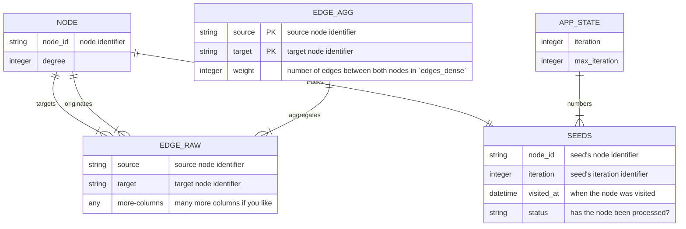
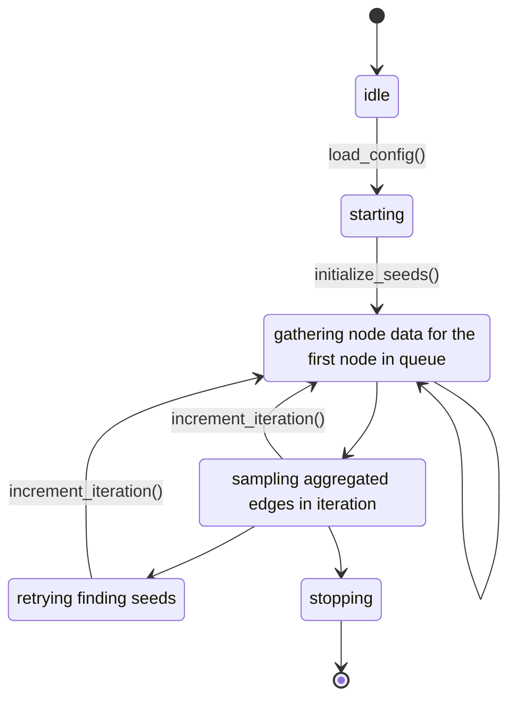

# spiderexpress

A multipurpose network sampling tool.


>   Traversing the deserts of the internet.

## Table of Contents

<!-- TOC -->
* [spiderexpress](#spiderexpress)
  * [Table of Contents](#table-of-contents)
  * [Installation](#installation)
  * [Usage](#usage)
    * [create](#create)
    * [start](#start)
    * [Project set up](#project-set-up)
  * [Configuration](#configuration)
  * [Table Schemas](#table-schemas)
    * [Edges](#edges)
      * [Raw Edges](#raw-edges)
      * [Aggregated Edges](#aggregated-edges)
    * [Nodes](#nodes)
  * [Operation Instructions](#operation-instructions)
  * [Included Connectors](#included-connectors)
    * [CSV connector](#csv-connector)
    * [Telegram connector](#telegram-connector)
  * [Included Strategies](#included-strategies)
    * [Spikyball Sampler](#spikyball-sampler)
    * [Random Sampler](#random-sampler)
  * [Extending spiderexpress](#extending-spiderexpress)
    * [Connector Specification](#connector-specification)
    * [Strategy Specification](#strategy-specification)
    * [Additional Parameters and Configurability](#additional-parameters-and-configurability)
    * [Example 1: a sweet and simple strategy](#example-1--a-sweet-and-simple-strategy)
    * [Example 2: a nice connector](#example-2--a-nice-connector)
<!-- TOC -->

## Installation

In order to use `spiderexpress` you need to have Python 3.8 or higher and poetry installed on your system.

1. Clone the repository `git clone https://github.com/Leibniz-HBI/spiderexpress.git`.
2. Install the dependencies `cd spiderexpress` and `poetry install`.
3. Activate the virtual environment `poetry shell`
4. Run the CLI `spiderexpress --help`.

In the future we will provide a PyPI package which will make the installation process much easier.

## Usage

```bash
$ spiderexpress --help
Usage: spiderexpress [OPTIONS] COMMAND [ARGS]...

  Traverse the deserts of the internet.

Options:
  --help  Show this message and exit.

Commands:
  create  create a new configuration
  start   start a job
  list    list all available connectors and strategies
```

### create

This command creates a `spiderexpress` project in the current directory.

```bash
Usage: spiderexpress create [OPTIONS] CONFIG

  create a new configuration

Options:
  --interactive / --non-interactive
```

This leads you through a dialogue to create a configuration file for your project.
You need to supply at least the following information:
- the name of the project,
- a path for the seed file.

```bash
### start

This command starts a `spiderexpress` job with the given configuration file.

```bash
Usage: spiderexpress start [OPTIONS] CONFIG

  start a job

Options:
  --help  Show this message and exit.
```
### Project set up

A `spiderexpress` project could for example look like this:

```tree
├── my_project
│   ├── my_project.pe.yml
│   ├── my_project.db
│   └── seed_file.json
```

Whereas `my_project.db` is the resulting database, `my_project.pe.yml` is the project's configuration in which a data source and sampling strategy and other parameters may be specified (see [Configuration](#configuration) for further details) and `seed_file.txt` is a text file which contains one node name per line.

For example projects, please refer to the `examples` directory or the unit tests in [/tests/](/tests/).

## Configuration

`spiderexpress` utilizes YAML de-/serialization for its configuration file. As such, initializing a project is as easy as: running `$ spiderexpress create` and a pleasurable and comforting dialogue prompt will guide you through the process.

The resulting file could look like something like this example:

```yaml
db_url: sqlite:/// # in memory database for testing
db_schema:
empty_seeds: stop
max_iteration: 10000
layers:
  test:
    eager: false
    connector:
      csv:
        node_list_location: tests/stubs/7th_graders/nodes.csv
        edge_list_location: tests/stubs/7th_graders/edges.csv
        mode: out
    routers:
      - all:  # This is the name of the router and should be the type of edge.
          source: source  # This is the field that is mapped to the source columns.
          target:
            - field: target  # This is the field that is mapped to the target columns.
              dispatch_with: test  # This is the name of the layer to dispatch to.
    sampler:
      random:
        n: 5
project_name: spider
seeds:
  test:
    - "1"
    - "13"
```

> [!note] Nomenclature
> `spiderexpress` uses `source`and `target` as they variable names for the edges, nodes must have a `name`.

## Table Schemas

`spiderexpress` is an entirely persistent application, meaning that all of its state information are kept,
including the data retrieved from the connectors, dense network-layer, the sparse network as well as the application's own
data.

Most of the user-facing data is kept in the following few tables:

- `raw_data`, here we keep the raw data, as returned by the connector.
- `layer_dense_edges` and `layer_dense_nodes`, here we keep the network information on the dense network.
- `layer_sparse_edges` and `layer_sparse_nodes`, sample as above, but only the sampled edges are included.


How the tables are structured is determined by the configuration file.
The following sections describe the minimal configuration for the tables as well as the configuration syntax.

Both tables are created if they do not exist; the name of the tables are determined by the configuration file.
For example, consider the following configuration snippet:

```yaml
edge_raw_table:
  name: tg_edges_raw
  columns:
    post_id: Text
    datetime: Text
    views: Integer
    text: Text
    forwarded_message_url: Text
```

This will create a table named `tg_edges_raw`, under `columns` column names and their types are specified.
Allowed types are `Text`, `Integer`.


> **Note**
> Column names are used to get data from the connector, thus,
> they must be present in the connector's output – otherwise they will contain `None`-values.




### Edges

The edges of the network are kept in two tables: *edges_raw* and *edges_agg*,
whereas in the aggregated table only sampled edges are persisted and the raw table
includes all edges spiderexpress collected in the process.

The following table informs about the minimally necessary columns it will create,
although more metadata can be stored in the table.

#### Raw Edges

The raw edges table contains all edges that were collected by the connector.
Which columns are persisted is determined by the configuration as well as the data coming from the connector.

| **Column Name** | **Description**                                      |
|-----------------|------------------------------------------------------|
| **source**      | source node name                                     |
| **target**      | target node name                                     |
| **...**         | optionally additional data coming from the connector |

Columns are specified as key-value-pairs, available data types are `Text` and `Integer`.
```yaml
edge_raw_table:
  name: tg_edges_raw
  columns:
    post_id: Text
    datetime: Text
    views: Integer
    text: Text
    forwarded_message_url: Text
```

#### Aggregated Edges

As the name suggests in this the aggregated, simple edges are kept and persisted after sampling.
The following table informs about the minimally available columns `spiderexpress` will create.

| **Column Name** | **Description**                             |
|-----------------|---------------------------------------------|
| **source**      | source node name                            |
| **target**      | target node name                            |
| **weight**      | number of multi-edges between the two nodes |
| **...**         | optionally additional data                  |

The aggregation can be specified in the configuration file, again with key-value-pairs specifying the column name and the aggregation function. Available aggregation functions are `sum`, `min`, `max`, `avg` and `count`. **Note**: only numeric columns may be aggregated and used in the sampler configuration.

```yaml
edge_agg_table:
  name: tg_edges_agg
  columns:
    views: sum
```

### Nodes

The nodes of the network are kept a `node`-table. The following table informs about the minimally necessary columns it will create, although more metadata can be stored in the table, similarly to the specification under [Raw Edges](#raw-edges).

| **Column Name** | **Description**                                      |
|-----------------|------------------------------------------------------|
| **name**        | node identifier                                      |
| **...**         | optionally additional data coming from the connector |

## Operation Instructions




## Included Connectors

### CSV connector

This connector reads network from CSV files, one for the edges and, optionally, one for node information.
The tables must follow the above stated column names for both kinds of tables.
Required configuration are the following key-value-pairs:

| Key                | Description                                                   |
|--------------------|---------------------------------------------------------------|
| edge_list_location | relative or absolute path to the edge CSV-file.               |
| node_list_location | relative or absolute path to the edge CSV-file.               |
| mode               | either "in", "out" or "both", determines which edges to emit. |


Information must be given in the `spiderexpress`-project configuration file, e.g. consider the following configuration snippet:

```yaml
connector:
  csv:
    edge_list_location: path/to/file.csv
    node_list_location: path/to/file.csv
    mode: out
```

> **Note**
> In the current implementation the tables are reread on each call of the connector, thus,
> loading large networks will lead to long loading times.

### Other connectors

- **Telegram**: A connector scrapes the latest messages of a Telegram's channel public website. Find it [on GitHub](https://github.com/Leibniz-HBI/ponyexpress-telegram).
- **Twitter**: A connector to retrieve followers, friends and other things from Twitter. Find it [on GitHub](https://github.com/Leibniz-HBI/ponyexpress-twitter).

## Included Strategies

### Spikyball Sampler

This strategy samples implements a weighted random sampling of the network's edges, whereas the variables to utilize for the weighting can be specified in the configuration file.

```yaml
spikyball:
    layer_max_size: 150
    sampler:
      source_node_probability:
        coefficient: 1
        weights:
          subscriber_count: 4
          videos_count: 1
      target_node_probability:
        coefficient: 1
        weights:
      edge_probability:
        coefficient: 1
        weights:
          views: 1
```

The following table informs about the configuration keys and their meaning:

| Key                                 | Description                                                                       |
|-------------------------------------|-----------------------------------------------------------------------------------|
| **layer_max_size**                  | maximum number of nodes to sample in one iteration                                |
| **source_node_probability**         | probability of sampling a source node                                             |
| **target_node_probability.weights** | column names in the node table and the weight it should be assigned to            |
| **edge_probability**                | probability of sampling an edge                                                   |
| **\*.weights**                      | column names in the aggregated edge table and the weight it should be assigned to |
| **\*.coefficient**                  | coefficient to multiply the probability with                                      |

Specified columns must be present in the node and edge tables, and thus, must be specified in the configuration file as well.
See the [configuration](#configuration) section for more information on where to specify which data columns should be included in both the node table and the aggregation specification for the aggregated edge table.

### Random Sampler

This strategy samples implements a random sampling of the network's edges (and it's implementation is shown [below](#example-2--a-nice-connector)). The configuration is simple and only requires the following key-value-pair:

| **Key** | **Description**                                    |
|---------|----------------------------------------------------|
| **n**   | maximum number of nodes to sample in one iteration |

----

## Extending spiderexpress

`spiderexpress` is extensible via plug-ins and sports two `setuptools`entry points to register plug-ins with:

- `spiderexpress.connectors` under which a connector may be registered, i.e. a program that retrieves and returns *new* data from a data source.
- `spiderexpress.strategies` under which sampling strategies may be registered.

### Connector Specification

The idea of a `Connector` is to deliver *new* information of the network to be explored. The function takes a `List[str]` which is a list of node names for which we need information about, and it returns two dataframes, the edges and the node information.
All Connectors must implement the following function interface:

```python
Connector = Callable[[list[str]], tuple[pd.DataFrame, pd.DataFrame]]
# Connector(node_names: List[str]) -> DataFrame, DataFrame
```
Where the returns are the following:

- `List[str]` is a list of the new **seed nodes** for the next iteration,
- `DataFrame` is the table of new **edges** to be added to the network,
- `DataFrame` is the table of new **nodes** to be added to the network.
- `Dict` is a dictionary holding additional configuration information fo the strategy.


### Strategy Specification

```python
Strategy = Callable[[pd.DataFrame, pd.DataFrame, list[str]], Tuple[list[str], pd.DataFrame, pd.DataFrame]]
# Strategy(edges: DataFrame, nodes: DataFrame, known_nodes: List[str]) -> List[str], DataFrame, DataFrame
```
The parameters are the following:
- `DataFrame` is the table of **edges** to be sampled,
- `DataFrame` is the table of **nodes** to be sampled.
- `List[str]` is a list of the **visited nodes**,
- `Dict` is a dictionary holding additional configuration information fo the strategy.

Where the returns are the following:

- `List[str]` is a list of the new **seed nodes** for the next iteration,
- `DataFrame` is the table of new **edges** to be added to the network,
- `DataFrame` is the table of new **nodes** to be added to the network.

### Additional Parameters and Configurability

The registered plug-ins must follow the below stated function interfaces. Although any additional parameters stated in the configuration file will be passed into the function as well.

E.g. if a configuration file states:

```yaml
strategy:
  random:
    n: 15
```

will result in the following function call `random(edges, nodes, known_nodes, {"n": 15})` at the sampling stage.

### Example 1: a sweet and simple strategy

To further illustrate the process we consider an implementation of random sampling,
here our strategy is to select 10 random nodes for each layer:

```python
from typing import Any, Dict, List

import pandas as pd


def random_strategy(
    edges: pd.DataFrame,
    nodes: pd.DataFrame,
    known_nodes: List[str],
    configuration: Dict[str, Any],
):
    """Random sampling strategy."""
    # split the edges table into edges _inside_ and _outside_ of the known network
    mask = edges.target.isin(known_nodes)
    edges_inward = edges.loc[mask, :]
    edges_outward = edges.loc[~mask, :]

    # select 10 edges to follow
    if len(edges_outward) < configuration["n"]:
        edges_sampled = edges_outward
    else:
        edges_sampled = edges_outward.sample(n=configuration["n"], replace=False)

    new_seeds = edges_sampled.target  # select target node names as seeds for the
    # next layer
    edges_to_add = pd.concat([edges_inward, edges_sampled])  # add edges inside the
    # known network as well as the sampled edges to the known network
    new_nodes = nodes.loc[nodes.name.isin(new_seeds), :]

    return new_seeds, edges_to_add, new_nodes
```

### Example 2: a nice connector

To further illustrate the process we consider an implementation of a connector that reads data from a CSV file. The connector is designed to read data from a CSV file that contains a list of edges and (optionally) a list of nodes. The CSVConnectorConfiguration class defines the configuration options for the connector, including the location of the edge list CSV file, the mode of operation (in, out, or both), and the optional location of the node list CSV file.

The `csv_connector()` function takes two arguments: a list of node IDs and the configuration options. The function then reads in the edge list CSV file and (optionally) the node list CSV file using the Pandas library. Based on the mode of operation specified in the configuration options, the function filters the edge list to return only those edges that are connected to the specified nodes. If a node list CSV file is provided, the function also filters the node list to return only those nodes that are connected to the specified edges. The function then returns two Pandas dataframes, one containing the filtered edge list and the other containing the filtered node list (if provided).

1. The function takes two arguments: node_ids (a list of node IDs) and configuration (either a dictionary or an instance of CSVConnectorConfiguration class).

```python
def csv_connector(
    node_ids: List[str], configuration: Dict
) -> (pd.DataFrame, pd.DataFrame):
```

2. The function reads in the edge list CSV file using the Pandas read_csv() function and stores the resulting dataframe in a variable called edges. The dtype=str argument specifies that all columns should be read in as strings.

```python
edges = pd.read_csv(configuration["edge_list_location"], dtype=str)
```

3. If a node list CSV file location is provided in the configuration options, the function reads in the node list CSV file using the Pandas read_csv() function and stores the resulting dataframe in a variable called nodes. The dtype=str argument specifies that all columns should be read in as strings. If no node list CSV file location is provided, the nodes variable is set to None.

```python
nodes = (
    pd.read_csv(configuration["node_list_location"], dtype=str)
    if configuration["node_list_location"]
    else None
)
```

4. Based on the mode specified in the configuration options, the function creates a boolean mask that filters the edges dataframe to only include edges that are connected to the specified nodes. If mode is set to "in", the function filters for edges with a target node that is in node_ids. If mode is set to "out", the function filters for edges with a source node that is in node_ids. If mode is set to "both", the function filters for edges that are connected to nodes in node_ids in either direction (i.e., the edges have a source or target node that is in node_ids).

```python
if configuration["mode"] == "in":
    mask = edges["target"].isin(node_ids)
elif configuration["mode"] == "out":
    mask = edges["source"].isin(node_ids)
elif configuration["mode"] == "both":
    mask = edges["target"].isin(node_ids) | edges["source"].isin(node_ids)
else:
    raise ValueError(f"{configuration["mode"]} is not one of 'in', 'out' or 'both'.")
```

5. The function creates a new dataframe called edge_return that contains only the rows of the edges dataframe that are specified by the boolean mask.

```python
edge_return: pd.DataFrame = edges.loc[mask]
```

6. Finally, the function returns a tuple containing two dataframes: edge_return (the filtered edge list) and `nodes.loc[nodes.name.isin(node_ids), :]` (the filtered node list, if a node list CSV file location was provided in the configuration options and there are nodes connected to the filtered edges). If no node list CSV file location was provided or there are no nodes connected to the filtered edges, the function returns an empty dataframe for nodes.

```python
return (
    edge_return,
    nodes.loc[nodes.name.isin(node_ids), :]
    if nodes is not None
    else pd.DataFrame(),
)
```

And now: all together now! A complete implementation of the CSV connector is shown below; a more involved implementation is provided in the `spiderexpress.connectors.csv` module in the [connectors' directory](spiderexpress/connectors).

```python
from typing import Dict, List

import pandas as pd


def csv_connector(
    node_ids: List[str], configuration: Dict
) -> (pd.DataFrame, pd.DataFrame):
    """The CSV connector!"""

    # Read the edge table.
    edges = pd.read_csv(configuration["edge_list_location"], dtype=str)
    # Read the node table if provided.
    nodes = (
        pd.read_csv(configuration["node_list_location"], dtype=str)
        if configuration["node_list_location"]
        else None
    )

    # Filter edges based on the mode of operation.
    if configuration["mode"] == "in":
        mask = edges["target"].isin(node_ids)
    elif configuration["mode"] == "out":
        mask = edges["source"].isin(node_ids)
    elif configuration["mode"] == "both":
        mask = edges["target"].isin(node_ids) | edges["source"].isin(node_ids)
    else:
        raise ValueError(f"{configuration['mode']} is not one of 'in', 'out' or 'both'.")

    # Filter edges that contain our input nodes
    edge_return: pd.DataFrame = edges.loc[mask]

    return (
        edge_return,  # return the filtered edges
        nodes.loc[nodes.name.isin(node_ids), :]  # return the filtered nodes
        if nodes is not None                     # if there are nodes
        else pd.DataFrame(),
    )
```

## Deveplopment Installation

This software uses [poetry](https://python-poetry.org/) as a package management solution. In order to install all dependencies:

1. Have `poetry` installed.
2. Clone this repository.
3. `cd` into the newly created repositories' folder.
4. Install all dependencies with `poetry install`.
5. To enter the virtual environment, run `poetry shell`.
6. To run the test suite, run `pytest` inside the virtual environments shell.
7. To run this program, run `spiderexpress`.

---

2024, [Philipp Kessling](mailto:p.kessling@leibniz-hbi.de) under the MIT license.
