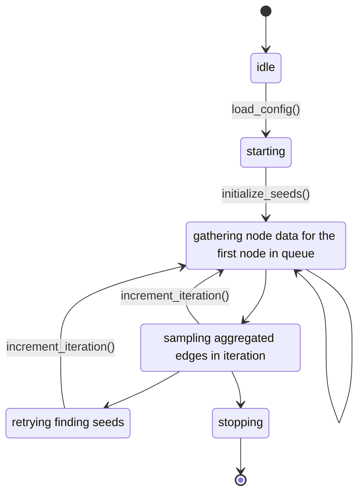
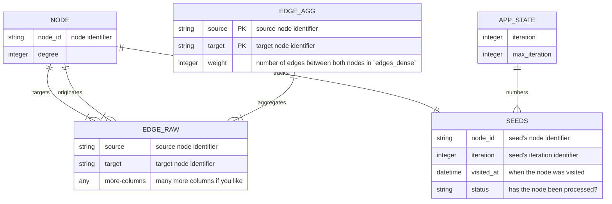

# ponyexpress

A multipurpose network sampling tool.


>   Traversing the deserts of the internet.

## Table of Contents

<!-- TOC -->
* [ponyexpress](#ponyexpress)
  * [Table of Contents](#table-of-contents)
  * [Installation](#installation)
  * [Usage](#usage)
    * [create](#create)
    * [start](#start)
    * [Project set up](#project-set-up)
  * [Operation Instructions](#operation-instructions)
  * [Configuration](#configuration)
  * [Table Schemas](#table-schemas)
    * [Nodes](#nodes)
    * [Edges](#edges)
  * [Included Connectors](#included-connectors)
    * [CSV connector](#csv-connector)
    * [Telegram connector](#telegram-connector)
  * [Extending Ponyexpress](#extending-ponyexpress)
    * [Connector Specification](#connector-specification)
    * [Strategy Specification](#strategy-specification)
    * [Additional Parameters and Configurability](#additional-parameters-and-configurability)
    * [Example 1: a sweet and simple strategy](#example-1--a-sweet-and-simple-strategy)
    * [Example 2: a nice connector](#example-2--a-nice-connector)
<!-- TOC -->

## Installation

In order to use `ponyexpress` you need to have Python 3.8 or higher and poetry installed on your system.

1. Clone the repository

```bash
$ git clone https://github.com/Leibniz-HBI/ponyexpress.git
```

2. Install the dependencies

```bash
$ cd ponyexpress
$ poetry install
```

3. Activate the virtual environment

```bash
$ poetry shell
```

4. Run the CLI

```bash
$ ponyexpress --help
```

In the future we will provide a PyPI package which will make the installation process much easier.

## Usage


```bash
$ ponyexpress --help
Usage: ponyexpress [OPTIONS] COMMAND [ARGS]...

  Traverse the deserts of the internet.

Options:
  --help  Show this message and exit.

Commands:
  create  create a new configuration
  start   start a job
```

### create

```bash
Usage: ponyexpress create [OPTIONS] CONFIG

  create a new configuration

Options:
  --interactive / --non-interactive
```

### start

```bash
Usage: ponyexpress start [OPTIONS] CONFIG

  start a job

Options:
  --help  Show this message and exit.
```
### Project set up

A `ponyexpress` project will need the following files in place in the project directory (here exemplary named `my_project`), whereas the SQLITE-database will be created if it not exists.

```tree
my_project/
|- my_project.sqlite
|- my_project.pe.yml
|- seed_file.txt
```

Whereas `my_project.sqlite` is the resulting database, `my_project.pe.yml` is the project's configuration in which a data source and sampling strategy and other parameters may be specified (see [Configuration](#configuration) for further details). `seed_file.txt` is a text file which contains one node name per line.

## Operation Instructions




## Configuration

`Ponyexpress` utilizes YAML de-/serialization for it's configuration file. As such, initializing a project is as easy as: running `$ ponyexpress create` and a pleasureable and comforting dialogue prompt will guide you through the process.

The resulting file could look like something like this example:

```yaml
project_name: spider
batch_size: 150
db_url: test2.sqlite
max_iteration: 10000
edge_table_name: edge_list
node_table_name: node_list
seeds:
  - ...
connector: telegram
strategy:
  spikyball:
    layer_max_size: 150
    sampler:
      source_node_probability:
        coefficient: 1
        weights:
          subscriber_count: 4
          videos_count: 1
      target_node_probability:
        coefficient: 1
        weights:
      edge_probability:
        coefficient: 1
        weights:
          views: 1
```

## Table Schemas

How the tables are structured is determined by the configuration file.
The following sections describe the minimal configuration for the tables as well as the configuration syntax.

Both tables are created if they do not exist; the name of the tables are determined by the configuration file.
For example, consider the following configuration snippet:

```yaml
edge_raw_table:
  name: tg_edges_raw
  columns:
    post_id: Text
    datetime: Text
    views: Integer
    text: Text
    forwarded_message_url: Text
```

This will create a table named `tg_edges_raw`, under `columns` column names and their types are specified.
Allowed types are `Text`, `Integer`.


> **Note**
> Column names are used to get data from the connector, thus,
> they must be present in the connector's output – otherwise they will contain `None`-values.




### Nodes

The nodes of the network are kept in two tables that adhere to the same schema:
*sparse_nodes* and *dense_nodes*, whereas in the sparse table only sampled nodes are
persisted and the dense table includes all nodes ponyexpress collected in the process.

The following table informs about the minimally necessary columns it will create,
although more metadata can be stored in the table.

| Column Name | Description                                         |
| ----------- | --------------------------------------------------- |
| name        | node identifier                                     |
| ...         | optionally additional data coming from the connector |

### Edges

The edges of the network are kept in two tables: *edges_raw* and *edges_agg*,
whereas in the aggregated table only sampled edges are persisted and the raw table
includes all edges ponyexpress collected in the process.

The following table informs about the minimally necessary columns it will create,
although more metadata can be stored in the table.

**Raw Edges**: The raw edges table contains all edges that were collected by the connector.
Which columns are persisted is determined by the configuration as well as the data coming from the connector.


| Column Name | Description                                          |
|-------------|------------------------------------------------------|
| source      | source node name                                     |
| target      | target node name                                     |
| ...         | optionally additional data coming from the connector |

**Aggregated Edges**

| Column Name | Description                                          |
|-------------|------------------------------------------------------|
| source      | source node name                                     |
| target      | target node name                                     |
| weight      | number of multi-edges between the two nodes          |
| ...         | optionally additional data coming from the connector |

## Included Connectors

### CSV connector

This connector reads network from CSV files, one for the edges and, optionally, one for node information.
The tables must follow the above stated column names for both kinds of tables.
Required configuration are the following key-value-pairs:

| Key                | Description                                                   |
|--------------------|---------------------------------------------------------------|
| edge_list_location | relative or absolute path to the edge CSV-file.               |
| node_list_location | relative or absolute path to the edge CSV-file.               |
| mode               | either "in", "out" or "both", determines which edges to emit. |


Information must be given in the `ponyexpress`-project configuration file, e.g. consider the following configuration snippet:

```yaml
connector:
  csv:
    edge_list_location: path/to/file.csv
    node_list_location: path/to/file.csv
    mode: out
```

> **Note**
> In the current implementation the tables are reread on each call of the connector, thus,
> loading large networks will lead to long loading times.

### Telegram connector

This connector scrapes network data from public Telegram channels.
Currently, it returns forwarded messages for the last 20 messages per channel.

> **Note**: No configuration can be supplied at this time. Although an overhaul is on the roadmap.

----

## Extending Ponyexpress

`Ponyexpress` is extensible via plug-ins and sports two `setuptools`entry points to register plug-ins with:

- `ponyexpress.connectors` under which a connector may be registered, i.e. a program that retrieves and returns *new* data from a data source.
- `ponyexpress.strategies` under which sampling strategies may be registered.

### Connector Specification

The idea of a `Connector` is to deliver *new* information of the network to be explored. The function takes a `List[str]` which is a list of node names for which we need information about and it returns two dataframes, the edges and the node information.
All Connectors must implement the following function interface:

```python
Connector = Callable[[list[str]], tuple[pd.DataFrame, pd.DataFrame]]
# Connector(node_names: List[str]) -> DataFrame, DataFrame
```
Where the returns are the following:

- `List[str]` is a list of the new **seed nodes** for the next iteration,
- `DataFrame` is the table of new **edges** to be added to the network,
- `DataFrame` is the table of new **nodes** to be added to the network.
- `Dict` is a dictionary holding additional configuration information fo the strategy.


### Strategy Specification

```python
Strategy = Callable[[pd.DataFrame, pd.DataFrame, list[str]], Tuple[list[str], pd.DataFrame, pd.DataFrame]]
# Strategy(edges: DataFrame, nodes: DataFrame, known_nodes: List[str]) -> List[str], DataFrame, DataFrame
```
The parameters are the following:
- `DataFrame` is the table of **edges** to be sampled,
- `DataFrame` is the table of **nodes** to be sampled.
- `List[str]` is a list of the **visited nodes**,
- `Dict` is a dictionary holding additional configuration information fo the strategy.

Where the returns are the following:

- `List[str]` is a list of the new **seed nodes** for the next iteration,
- `DataFrame` is the table of new **edges** to be added to the network,
- `DataFrame` is the table of new **nodes** to be added to the network.

### Additional Parameters and Configurability

The registered plug-ins must follow the below stated function interfaces. Although any additional parameters stated in the configuration file will be passed into the function as well.

E.g. if a configuration file states:

```yaml
strategy:
  random:
    n: 15
```

will result in the following function call `random(edges, nodes, known_nodes, {"n": 15})` at the sampling stage.

### Example 1: a sweet and simple strategy

To further illustrate the process we consider a implementation of random sampling,
here our strategy is to select 10 random nodes for each layer:

```python
from typing import Any, Dict, List

import pandas as pd


def random_strategy(
    edges: pd.DataFrame,
    nodes: pd.DataFrame,
    known_nodes: List[str],
    configuration: Dict[str, Any],
):
    """Random sampling strategy."""
    # split the edges table into edges _inside_ and _outside_ of the known network
    mask = edges.target.isin(known_nodes)
    edges_inward = edges.loc[mask, :]
    edges_outward = edges.loc[~mask, :]

    # select 10 edges to follow
    if len(edges_outward) < configuration["n"]:
        edges_sampled = edges_outward
    else:
        edges_sampled = edges_outward.sample(n=configuration["n"], replace=False)

    new_seeds = edges_sampled.target  # select target node names as seeds for the
    # next layer
    edges_to_add = pd.concat([edges_inward, edges_sampled])  # add edges inside the
    # known network as well as the sampled edges to the known network
    new_nodes = nodes.loc[nodes.name.isin(new_seeds), :]

    return new_seeds, edges_to_add, new_nodes

```

### Example 2: a nice connector

To further illustrate the process we consider a implementation of a connector that reads data from a CSV file.
Here we assume that the CSV file contains the following columns:

```python
"""A CSV-reading, network-rippin' connector for your testing purposes."""
import dataclasses
from typing import Dict, List, Optional, Union

import pandas as pd

from ponyexpress.types import fromdict


@dataclasses.dataclass
class CSVConnectorConfiguration:
    """Configuration items for the csv_connector."""

    edge_list_location: str
    mode: str
    node_list_location: Optional[str] = None


def csv_connector(
    node_ids: List[str], configuration: Union[Dict, CSVConnectorConfiguration]
) -> (pd.DataFrame, pd.DataFrame):
    """The CSV connector!"""
    if isinstance(configuration, dict):
        configuration = fromdict(CSVConnectorConfiguration, configuration)

    edges = pd.read_csv(configuration.edge_list_location, dtype=str)
    nodes = (
        pd.read_csv(configuration.node_list_location, dtype=str)
        if configuration.node_list_location
        else None
    )
    if configuration.mode == "in":
        mask = edges["target"].isin(node_ids)
    elif configuration.mode == "out":
        mask = edges["source"].isin(node_ids)
    elif configuration.mode == "both":
        mask = edges["target"].isin(node_ids) | edges["source"].isin(node_ids)
    else:
        raise ValueError(f"{configuration.mode} is not one of 'in', 'out' or 'both'.")

    # Filter edges that contain our input nodes
    edge_return: pd.DataFrame = edges.loc[mask]

    return (
        edge_return,
        nodes.loc[nodes.name.isin(node_ids), :]
        if nodes is not None
        else pd.DataFrame(),
    )
```

---

2022, [Philipp Kessling](mailto:p.kessling@leibniz-hbi.de) under the MIT license.
